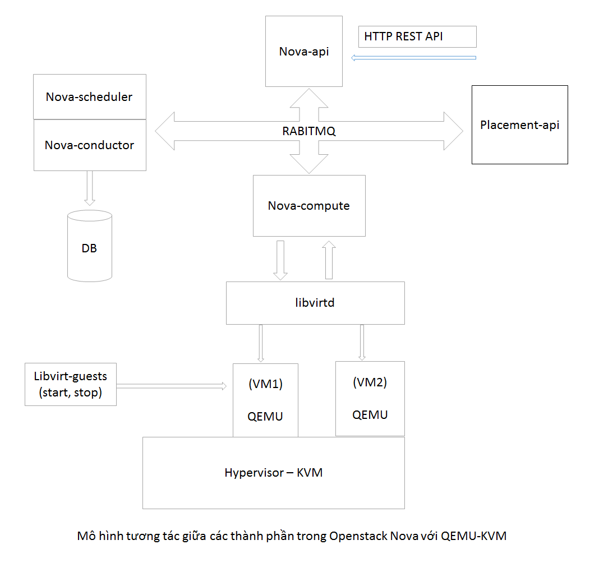

# Author: To Van Lam
### Link to read PDF file: https://www.slideshare.net/lamto01111995/solution-livemigrate-vm-in-openstack-with-cpu-pinning-configuratin
tovanlam20132223@gmail.com

#Tutorial
### On Node Controller
```bash
docker cp conductor/    nova-conductor:/usr/lib/python2.7/dist-packages/nova/
docker cp db/    nova-conductor:/usr/lib/python2.7/dist-packages/nova/
docker restart nova-conductor
```

### On Node Compute
```bash
docker cp  compute/   /usr/lib/python2.7/site-packages/nova/
docker cp  virt/				/usr/lib/python2.7/site-packages/nova/
systemctl restart openstack-nova-compute
```

# Xây dựng giải pháp Live Migrate VM có cấu

# hình Pin CPU

## 1. Giới thiệu các thành phần tham gia quá trình Live-Migrate VM

### 1.1 QEMU

- Là công cụ tạo và quản lý các tiến trình Virtual Machine, thực hiện quản lý việc truy
    cập của các VM tới CPU, memory và tài nguyên phần cứng (network, hard disk, VGA,
    USB ..).
Việc tương tác với QEMU nên bị giới hạn  Libvirt ra đời để cung cấp các interface cần
thiết cho việc tương tác với QEMU.

### 1.2 Libvirt

- Quản lý và tương tác với QEMU
- Định nghĩa các instance thông qua XML
- Làm nhiệm vụ chuyển đổi XML về các lệnh gọi QEMU
- Tương tác với user thông qua câu lệnh virsh
Một số câu lệnh virsh thông dụng:
    o virsh create: Tạo một domain từ XML file
    o virsh dumpxml: Print XML mà domain đang chạy được tạo
    o virsh edit : Chỉnh sửa file XML của domain, nội dung chỉnh sửa chỉ được áp
       dụng khi domain restart vì vậy nội dung trong virsh edit sẽ có thể khác với
       virsh dumpxml
    o virsh nodeinfo: Đưa thông số Mem và Cpu của host
    o virsh capabilities: Đưa ra toàn bộ thông tin của host bao gồm cả cpu layout
    o virsh vcpuinfo: Cung cấp thông tin VPU của instance, bao gồm cả cpu đang
       pin
    o virsh migrate: Thực hiện migrate instance sang host khác
    Live-migrate: _virsh migrate –live instance-xxxxxxx qemu+ssh://dest_host/system_

### 1.3 Nova Compute

```
Quản lý VM và tương tác với QEMU thông qua Libvirtd
Openstack Nova Compute là package thực hiện 2 chức năng chính trên theo tổ chức:
```
- Compute Manager:
```
o Folder: /usr/lib/python2.7/site-packages/nova/compute
o File: compute/api.py
o File: compute/manager.py
```
- Libvirt Driver:
```
    o Folder: /usr/lib/python2.7/site-packages/nova/virt/libvirt/
    o File: libvirt/driver.py
```
- Các hoạt động chính của Nova và libvirt:
    o Spawn
    o Reboot
    o Suspend
    o Resume
    o Migrate
    o Live-Migrate
    


## 2. Các Flow trong Openstack live-migration

### 2.1 Virsh live-migration

Tiến trình thực hiện live-migration VM qua lệnh
```
virsh migrate –live instance-xxxxxxx qemu+ssh://dest_host/system
```

Các bước thực hiện post-live-migration qua virsh:
o **Bước 1** : Bước chuẩn bị
 Tạo connection giữa source và dest QEMU, đảm bảo
“LIBVIRTD_ARGS="--listen" và đảm bảo QEMU version là giống nhau
 Xác định size huge page và dirty bitmap
 Cho phép dirty page logging
o **Bước 2:** Bước lặp
 Thiết lập băng thông, down time sử dụng cấu hình qemu.conf
 Tính toán số lượng Page Fault trong VM
 Lặp lại việc Copy fault page tới Destination
 Nếu remaining RAM < Bandwidth * down time  Pause VM bên
source lại và chuyển nốt phần RAM sang dest, thoát bước lặp
 Nếu remaining RAM > Bandwidth * downtime do tốc độ sinh
dirtypage quá nhiều , tăng down time đến khi đạt ngưỡng, tiếp tục
lặp.


o Bước 3: Bước kết thúc
 Cập nhật trạng thái VM trong 2 host
 undefine VM, giải phóng bộ nhớ trong source host
 define VM, cập nhật trạng thái dest host.
 Để tăng tốc độ live-migration thì có thể tăng network bandwidth hoặc tăng cấu
hình downtime.

### 2.2 Nova-Spawn


Tiến trình thực hiện boot VM thông qua lệnh ‘nova boot’
Luồng thực hiện:
nova-api -> nova-scheduler -> nova-compute -> libvirt driver
Tại bước lauch VM ở compute host:
o Tạo disk file:
 Download Image từ Glance về instance_dir/_base và chuyển nó về
dạng RAW (ko chuyển nếu mặc định là dạng RAW  Để dạng RAW
nếu mạng khỏe )
 Tạo các file QCOW2 'disk' : disk, disk.local, disk.swap
o Sinh file libvirt XML và ghi một copy vào instance_dir
 instance_dir/libvirt.xml không bao giờ được nova sử dụng mà chỉ đc
libvirt sử dụng
o Thiết lập volume connections dựa trên volume driver:
 LVM: ISCSI connection
 RBD: Ceph connection
o Tạo network cho VM
 Bật các bridge, Vlan
 Tạo sercurity group cho instance
o Định nghĩa domain với libvirt, sử dụng file XML sinh trước đó (từ memory).
 Tương tự như với lệnh virsh define instance_dir/<uuid>/libvirt.xml
o Start instance:
 Tương tự như với lệnh virsh start <domain name| uuid>

### 2.3 Nova-live_migration

**Bản chất của nova live-migration là sự kết hợp của virsh live-migration và nova-spawn
a. Normal live-migration hoặc Block live-migration:**
o Normal live-migration yêu cầu source host và dest host phải có share storage
o Block live-migration thì thực hiện thêm phần migrate disk như là một phần
của tiến trình
o Cả 2 loại đều yêu cầu source host và dest host dùng chung version QEMU
b. Workflow:
```
- **Bước 1:** User gọi HTTP Request vào nova-api thực hiện live-migration.
**openstack server migrate uuid_instance --live dest_host
Nova-api**  **self.compute_api.live_migrate(context, instance, block_migration,
disk_over_commit, host, force, async)**
- **Bước 2:** Xác minh storage backend đủ điều kiện tương thích với migration type
 Share storage check
 Cả source và dest compute service đều đang trong trạng thái running
 Một số exception có thể check ra ở thời điểm này:
 NoValidHost
 ComputeHostNotFound (dùng khi migrate bằng commad)
 InvalidHypervisorType (KVM ko hoạt động)
 InvalidCPUInfo (libvird ko hoạt động)
 UnableToMigrateToSelf ( lỗi khi chọn live-migrate tới chính host hiện
tại)
 InvalidSharedStorage ( Source và Dest Host không ở dạng share
storage)
 InstanceInvalidState (Chỉ có thể live-migration khi Instance đang
running)
 MigrationPreCheckError
 Sau khi check các điều kiện thành công nova-conductor trả về một Object
LiveMigrationTask mang nội dung của nhiệm vụ migration
**Nova-conductor**  **_build_live_migrate_task()**  **call LiveMigrationTask(base.TaskBase)**
return self.compute_rpcapi.live_migration(self.context,
host=self.source,
instance=self.instance,
dest=self.destination,
block_migration=self.block_migration,
migration=self.migration,
migrate_data=self.migrate_data)

```
 Thực hiện gọi RPC request live-migration với thông tin instance và migrate_data tới
source host và destination host
```
- **Bước 3** : Thực hiện các bước Pre_live_migration tại destination host
     Lấy thông tin Instance từ trong DB
       **_load_instance(instance_or_dict):**


```
instance = objects.Instance._from_db_object(context, objects.Instance(),
instance_or_dict, expected_attrs=metas)
 Lấy thông tin instance từ các service:
 Lấy instance network info từ neutron-service
 Lấy instance volume info từ cinder-service
 Với ceph đảm bảo vẫn có kết nối tới các instance volume trong ceph
 Thực hiện các bước pre_live_migration
 Tạo instance directory /var/lib/nova/instances/<uuid_instance>
 Tạo instance console log:
/var/lib/nova/instances/<uuid_instance>/console.log
libvirt_utils. get_instance_path_at_destination (instance, migrate_data)
<line 7412>
os. mkdir ( instance_path )
 Kết nối tới volumes trước khi live migration.
os.path.join(instance_dir, 'disk.info')
libvirt_utils.write_to_file(image_disk_info_path,
jsonutils.dumps( image_disk_info ))
self ._connect_volume (context, connection_info, instance,
allow_native_luks=allow_native_luks)
 Kết nối tới VIFs trước khi live migration, tạo object VIFVHostUser
LOG.debug('Plugging VIFs before live migration.', instance=instance)
max_retry = CONF.live_migration_retry_count
for cnt in range(max_retry):
try:
self. plug_vifs (instance, network_info )
```
- **Bước 4** : Thực hiện các bước Pre_live_migration tại Source host sau khi dest đã sẵn
    sàng
        Lấy thông tin instance dạng xml từ libvirt
          Tương đương với việc virsh dumpxml <uuid_instance>
        Cập nhật xml instance trả về new_xml_str
          **new_xml_str** = None
          if CONF.libvirt.virt_type != "parallels":
          **new_xml_str** = libvirt_migrate. **get_updated_guest_xml** (
          guest, migrate_data, self._get_volume_config)

```
 Gọi libvirt để truyền lệnh virsh migrate –live tuy nhiên có các tham số bổ
xung như domain_xml, bandwidth lấy từ /etc/nova/nova.conf/libvirt
```

```
guest.migrate(self._live_migration_uri(dest),
migrate_uri=migrate_uri,
flags=migration_flags,
params=params,
domain_xml = new_xml_str ,
bandwidth=CONF.libvirt.live_migration_bandwidth)
```
```
 Trong đó guest là object được tạo để đại diện cho từng domain VM trên host
hiện tại
self._host = host.Host(self._uri(), read_only,
lifecycle_event_handler=self.emit_event,
conn_event_handler=self._handle_conn_event)
guest = self._host. get_guest (instance)
def migrate (self, destination, migrate_uri=None, params=None, flags=0,
domain_xml=None, bandwidth=0):
self._domain. migrateToURI2 (
destination, miguri=migrate_uri, dxml= domain_xml ,
flags=flags, bandwidth= bandwidth )
```
- **Bước 5:** Libvirt ở 2 bên source và dest host thực hiện thao tác live-migration trong
    khi nova-compute ở 2 bên source và dest host thực hiện quan sát trạng thái của
    instance chờ đến khi thực hiện thao tác tiếp theo:
       self **._live_migration_monitor** (context, **instance** , guest, dest,
       post_method, recover_method,
       block_migration, migrate_data,
       finish_event, disk_paths)

```
Các trạng thái của instance trong quá trình này lần lượt là: Started -> Pause ->
Resumed
```
- **Bước 6** : Thực hiện Post-live-migration tại destination host:
    o Setup network trên destination host
       self.network_api. **setup_networks_on_host** (context, instance, self.host)
       migration = {'source_compute': instance.host, 'dest_compute': self.host, }
       self.network_api.migrate_instance_finish(context, instance, migration)
    o Cập nhật trạng thái instance lên database gồm host mới , power_state
       chuyển về running, task_state đổi từ migrating về None, node mới.


```
o Nova-compute tính toán tổng tài nguyên instance mới sử dụng và cập nhật
tổng thông tin tài nguyên khả dụng của host (bao gồm cả danh sách VCPU
pin)
self ._notify_about_instance_usage (
context, instance, "live_migration.post.dest.end",
network_info=network_info)
```
```
Tuy nhiên trong bước tính toán trên nếu nova-compute phát hiện ra
instance được live-migrate đã pin vào CPU mà các VM trước pin thì sẽ báo lỗi
trong hàm notify ở trên.
```
- **Bước 7:** Thực hiện Post-live-migration tại source host:
    o Ngắt kết nối tới volume và vif
    o Undefine instance và tính toán tổng tài nguyên khả dụng sau khi gỡ instance
       self.driver.cleanup(ctxt, instance, network_info,
       destroy_disks=destroy_disks,
       migrate_data=migrate_data,
       destroy_vifs=destroy_vifs)
       self.instance_events.clear_events_for_instance(instance)
       self.update_available_resource(ctxt)
       self._update_scheduler_instance_info(ctxt, instance)
    o Gửi thông báo migrate success


Mô hình tóm tắt các bước live-migration sử dụng Openstack-nova


## 3. Giải pháp live-migrate VM có cấu hình Pin CPU

### 3.1 Vấn đề hiện tại

```
Trong quá trình live-migrate Openstack Nova không thực hiện giám sát vấn đề Pin CPU của VM
 Xảy ra các tình huống sau:
Tình huống Vấn đề
VM pin ở CPU mà đã được dest host pin trước đó Quá trình live-migration diễn ra bình thường, VM
được bật lên ở destination và hoạt động bình
thường
Tuy nhiên VM đang dùng chung vpu với một VM
đã có sẵn trên destination host, nova báo error
khi cập nhật tài nguyên host
Source host và Dest host có cpu layout khác
nhau.
```
```
Khi live-migration sang dest host, VM yêu cầu pin
vào một CPU mà dest host không có.
```
```
Dest host có đủ CPU và RAM cho VM nhưng số
CPU, RAM này rải đều sang 2 Numa và nếu tính
riêng thì không có numa nào thỏa mãn
```
```
Cần phải báo lỗi và chặn tiến trình live-migration
ngay từ đầu.
```
Yêu cầu của giải pháp:

```
 Cần phải check thông tin instance và dest host trước khi live-migration để đảm bảo
dest host tồn tại ít nhất 1 numa có đủ tài nguyên.
 Trong quá trình live-migration thông tin VCPU của instance được cập nhật tại Dest
Host (đảm bảo new instance đã pin vào free CPU trên dest) nhưng thông tin này vẫn
phải giữ nguyên tại source host (dùng cho quá trình giải phóng resource tại source
host và tránh xung đột với libvirt khi instance đang live-migrate)
 Sau quá trình live-migration thông tin instance được cập nhật lên Database và được
cập nhật vào xml libvirt ( thông tin trên database dùng cho hard reboot còn thông
tin trên libvirt dùng cho soft reboot)
 Sau quá trình live-migration thông tin tài nguyên các host được cập nhật đúng
(Source host giải phóng vcpu cũ còn Dest Host ghi nhận đã sử dụng vcp mới)
```

### 3.2 Giải pháp thực hiện

```
Bước 1 : Bổ xung code phần check host_destination_vcpu
```
Trong class LiveMigrationTask bên cạnh các hàm check host có sẵn bổ xung hàm
_check_host_destination_vcpu_is_compatible() thực hiện:

```
 Check xem instance có đang ở cơ chế vcpu pin không
 Tính số Cpu và Memory free mà destination host có trên từng numa
 Kiểm tra với mỗi numa nếu đủ tài nguyên cho instance thì pass nếu không có numa nào
đủ cả Cpu và Memory thì raise exception:
```
msg = (_('Check can live migrate to host failed: %(dest)s'
'No numa available with %(size_vcpus_instance)s vcpu and %(size_ram_instance)s
memory. '
'Error from Destination numa_topology %(numa_topology)s ') %
{'dest':self.destination,
'size_vcpus_instance': size_vcpus_instance,
'size_ram_instance': size_ram_instance,
'numa_topology': compute_numa_topology
})

Kết quả:

**Bước 2:** Chỉnh sửa file xml được nova-compute trên source host gửi cho libvirt trước khi
libvirt dùng file này gửi cho libvirt bên dest host.


Nhận xét:

- Trước khi nova-compute gọi libvirtd thực hiện virsh migrate có sử dụng hàm
    get_updated_guest_xml() để lấy thông tin của instance domain dưới dạng xml.
- File xml này sau đó được gửi sang bên destination host và được sử dụng để create
    VM bên dest host (tương tự như virsh create file.xml ).

 Để cập nhật vcpu ở dest mà không làm ảnh hưởng tới quá trình live-migration thì chỉ cần
sửa file xml trước khi gửi

Trong /nova/virt/libvirt/driver.py bổ xung function
get_updated_guest_xml_with_reset_cpu_pinned() và dùng hàm này thay thế cho hàm
get_updated_guest_xml() gốc.

Nội dung hàm get_update_guest_xml_with_reset_cpu_pinned():

- Lấy thông tin vcpu và mem instance
- Tìm trên dest host numa có đủ vcpu và mem
- Tìm trong numa trên danh sách vcpu mới cho instance
- Cập nhật vào file xml danh sách vcpu mới và thông tin numa id.

**Bước 3:** Chỉnh sửa instance database tại các bước post_live_migration_at source và
post_live_migration_at_dest

Nhận xét:

- Mặc dù sau các bước trên VM mới tạo đã pin vào đúng cpu mới như mong muốn
    nhưng thông tin instance trên database vẫn là thông tin cũ, nova vẫn báo lỗi trùng
    CPU
- Nguyên nhân do thông tin instance trên database chưa được cập nhật

Giải pháp:

- Tại các bước post_live_migration sau khi quá trình live-migrate đã hoàn tất ta có thể
    thực hiện chỉnh sửa thông tin object instance và cập nhật lên database thông qua
    nova-conductor.
- Tuy nhiên vì yêu cầu source host vẫn cần check thông tin instace cũ trên database để
    giải phóng tài nguyên cho đúng
     Chỉ cập nhật database sau khi check được source host đã giải phóng tài nguyên
    Trình tự thời gian cập nhật đúng:
       + Giải phóng tài nguyên trên source host
       Cập nhật thông tin instance trên database
       + Thống kê thông tin tài nguyên trên dest host


- Database được cập nhật bằng cách cập nhật object instance và gửi request cập nhật
    tới nova-conductor.
    **Bước 4:** Cập nhật lại file instance.xml
    Trong quá trình live-migration nova và libvirtd có một số hàm ghi lại thông tin
instance vào file xml. File này sẽ được libvirt sử dụng khi chạy soft reboot và được user
sử dụng để check thông tin VM

 Để thuận tiện tránh việc cập nhật này bị ghi đè thì thực hiện cập nhật file này tại
bước cuối cùng khi nova đã gửi thông báo live-migrate success
def post_live_migration_at_destination(self, context,
instance,
network_info,
block_migration=False,
block_device_info=None):
self._host.write_instance_config(self._host.get_guest(instance).get_xml_desc())


### 3.3 Minh họa giải pháp


